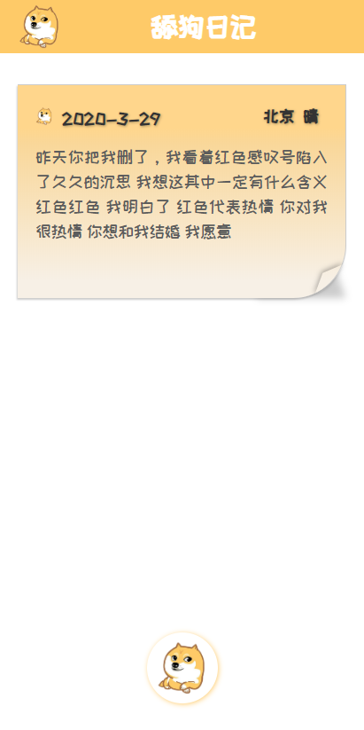

# Tiangou

一个舔狗的终极日记，采用json文件存储，没有数据库。




### 演示地址：

http://tg.xygeng.cn/

### 后台文件

在public的admin/admin.php，只要负责存储数据，$password存储后台管理登陆地址

默认后台管理地址： 域名+/myadmin

### 部署

1. 服务器环境：

直接打包，把dist文件上传服务器，给admin.php文件赋予读取写入权限

linux权限如下：

```
chmod 777 admin.php
```

2. 编辑环境：

需要把admin文件夹放到本地服务器，赋予读取写入权限，并在src/http/index.js更改请求接口，再运行项目


### 初始化

```
npm install
```

### 运行
```
npm start
```

### 打包
```
npm run build
```


